# tts-saves
TS_AutoSave
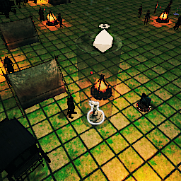
TS_AutoSave_2

TS_AutoSave_3
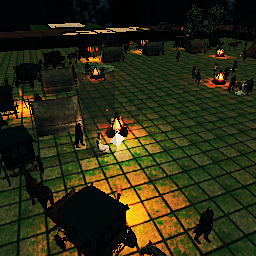
TS_Save_10
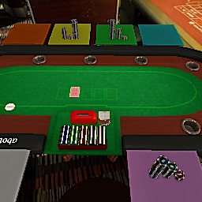
TS_Save_11
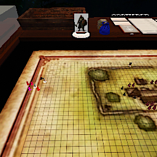
TS_Save_12
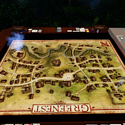
TS_Save_13
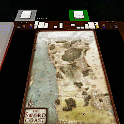
TS_Save_14
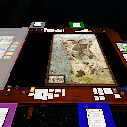
TS_Save_15
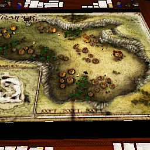
TS_Save_16
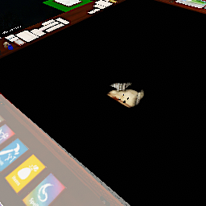
TS_Save_17
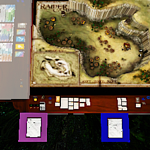
TS_Save_18
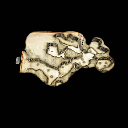
TS_Save_19
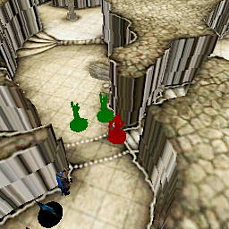
TS_Save_2
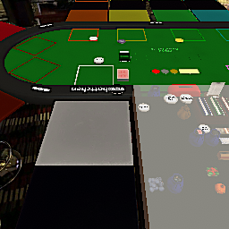
TS_Save_20

TS_Save_21
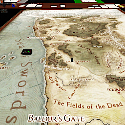
TS_Save_22
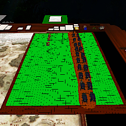
TS_Save_23
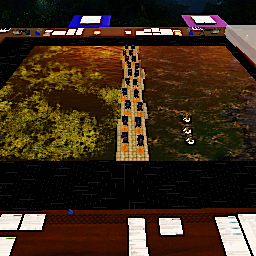
TS_Save_24
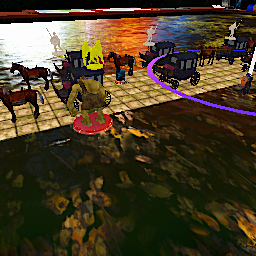
TS_Save_25

TS_Save_26

TS_Save_5

TS_Save_6
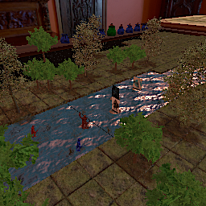
TS_Save_7
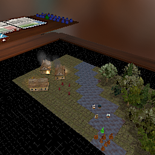
TS_Save_9
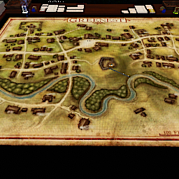
