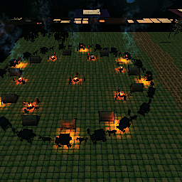

# tts-saves
TS_AutoSave
 

 
TS_AutoSave_2
 

 
TS_AutoSave_3
 

 
TS_Save_10
 

 
TS_Save_13
 

 
TS_Save_14
 

 
TS_Save_15
 

 
TS_Save_16
 

 
TS_Save_17
 

 
TS_Save_2
 

 
TS_Save_20
 

 
TS_Save_21
 

 
TS_Save_23
 

 
TS_Save_25
 

 
TS_Save_26
 

 
TS_Save_5
 

 
